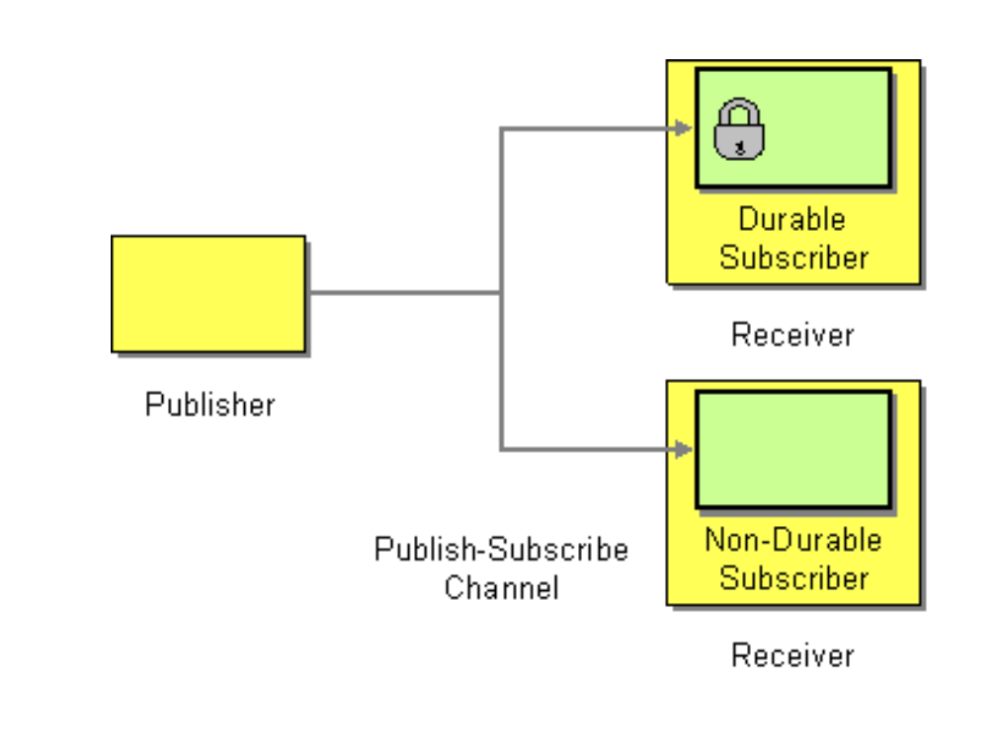
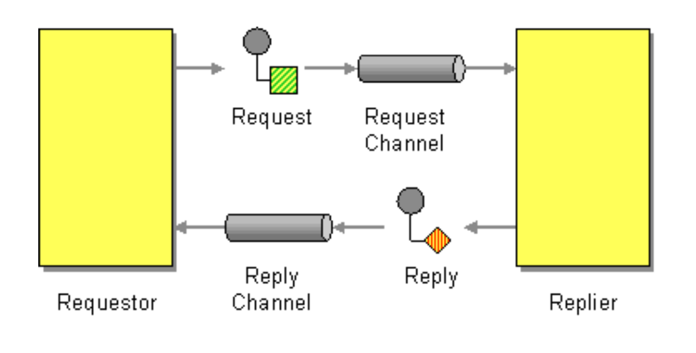
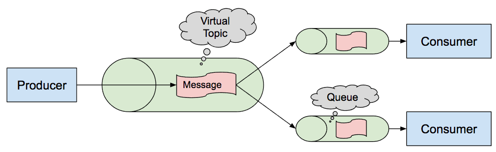

ActiveMQ
Prerequisites:
Download and install classic ActiveMQ.
Practical Task:

TASK I. Implement publish/subscribe interaction between two applications. Check durable vs non-durable subscription.
* DONE in modules: publisher + subscriber (endpoint Post "/api/v1/publisher/{message}")
* NOTE: also used java object convertor to message + message headers
* NOTE: queue is always durable. Topic Subscriber's durability should be configured in bean DefaultJmsListenerContainerFactory.

https://activemq.apache.org/how-do-durable-queues-and-topics-work.html

For example imagine a durable subscriber S starts up subscribing to topic T at time D1. Some publisher sends messages M1, M2, M3 to the topic and S will receive each of these messages. Then S is stopped and the publisher continues to send M4, M5.

When S restarts at D2, the publisher sends M6 and M7. Now S will receive M4, M5 followed by M6 and M7 and all future messages. i.e. S will receive all messages from M1..M7.

This is the difference between durable and non-durable consuming. If S were a non-durable consumer then it would only have received M1, M2, M3 and M6, M7 - not M4 and M5. i.e. because the subscription is durable, S will receive every message sent to T whether the subscriber is running or not. For non-durable topics, only messages delivered to the topic T when S is running are delivered.

Figure 1: image info

===============================================================================================

TASK II. Implement request-reply interaction between two applications using a temporary queue in ActiveMQ.
* DONE with predefined queues in modules: publisher + subscriber (endpoint Post "/api/v1/publisher/syncqueues/{message}")
* DONE with temporary reply queue in modules: tempQueueProducer + tempQueueConsumer. We send a request to a regular/predefined queue, but we receive a response using a temporary queue

https://activemq.apache.org/how-should-i-implement-request-response-with-jms

Figure 2: image info

===============================================================================================

TASK III. Implement subscriber scaling, i.e. create n subscribers to a topic with the same ClientID (see Virtual Topics in ActiveMQ)
* DONE in modules: virtualTopicProducer -> virtualTopicConsumer1 + virtualTopicConsumer2

https://activemq.apache.org/virtual-destinations

E.g., let’s say we have a topic called VirtualTopic.Orders. (Where the prefix VirtualTopic. indicates its a virtual topic). And we logically want to send orders to systems A and B. Now with regular durable topics we’d create a JMS consumer for clientID_A and “A” along with clientID_B and “B”.

With virtual topics we can just go right ahead and consume to queue Consumer.A.VirtualTopic.Orders to be a consumer for system A or consume to Consumer.B.VirtualTopic.Orders to be a consumer for system B.

We can now have a pool of consumers for each system which then compete for messages for systems A or B such that all the messages for system A are processed exactly once and similarly for system B.

Figure 3: image info
